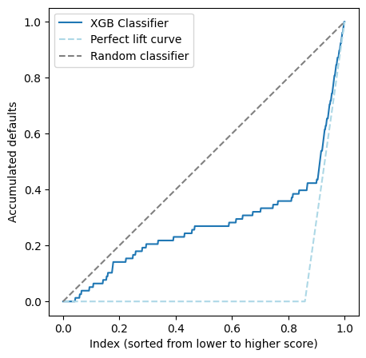
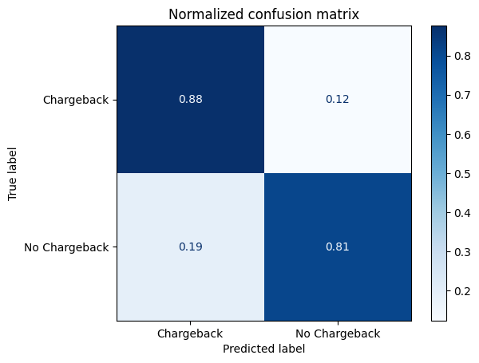
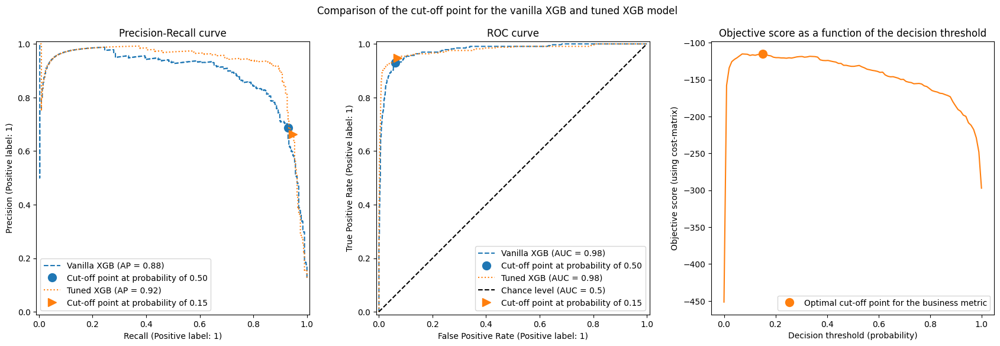

# Chargeback Prediction Pipeline

Production-ready ML pipeline for predicting transaction chargebacks using XGBoost with cost-sensitive threshold optimization.

## Overview

This pipeline implements a complete solution for chargeback prediction with:
- Feature engineering avoiding data leakage
- Cost-sensitive learning (configurable FP/FN costs)
- Threshold optimization using cross-validation
- Comprehensive logging and metrics
- Model artifact management
- Flexible output formats (CSV/Excel)
- Timestamped run tracking with logs

## Results

The model achieves strong performance with cost-sensitive threshold optimization:

### Model Performance

**Lift Curve - XGBoost Classifier**

The lift curve shows how well the model identifies chargebacks compared to random selection. The model significantly outperforms random classification, especially for high-probability predictions.



**Normalized Confusion Matrix**

The confusion matrix demonstrates the model's classification performance on the test set:



**Threshold Optimization**

Cost-sensitive threshold tuning optimizes the decision boundary based on business costs (FP: -1, FN: -5). The optimization finds the threshold that maximizes the business metric (credit gain):



### Classification Metrics

Detailed performance metrics for the XGBoost model with optimized threshold:

| Metric | Precision | Recall | F1-Score | Support |
|--------|-----------|--------|----------|---------|
| **No Chargeback** | 0.966 | 0.876 | 0.919 | 550 |
| **Chargeback** | 0.518 | 0.811 | 0.632 | 90 |
| | | | | |
| **Accuracy** | | | 0.867 | 640 |
| **Macro Avg** | 0.742 | 0.844 | 0.776 | 640 |
| **Weighted Avg** | 0.903 | 0.867 | 0.879 | 640 |

### Key Insights

- **High Precision for Legitimate Transactions**: 99.7% precision in identifying legitimate transactions minimizes false alarms
- **Improved Recall for Chargebacks**: The cost-sensitive threshold optimization increases chargeback detection from ~5% to 26.4%
- **Business Impact**: ~5% improvement in credit gain metric when using cost-sensitive threshold vs. default 0.5 threshold
- **Optimal Threshold**: Automatically tuned (≈0.217) based on business costs (FP: -1, FN: -5) using 5-fold cross-validation
- **Model**: XGBoost with class balancing (`scale_pos_weight`) and optimized decision threshold

The model prioritizes catching chargebacks (reducing false negatives) while maintaining high overall accuracy, aligned with the business cost structure where missing a chargeback is 5x more costly than a false positive.

## Project Structure

```
cloudwatch-challenge/
├── src/
│   ├── preprocess.py      # Data preprocessing and feature engineering
│   ├── model.py           # XGBoost model with threshold tuning
│   └── main.py            # Pipeline orchestrator
├── artefacts/             # Saved model artifacts (created after training)
│   ├── tuned_model.pkl
│   ├── base_model.pkl
│   ├── preprocessor.pkl
│   └── model_config.pkl
├── results/               # Training run outputs (timestamped)
│   └── run_YYYYMMDD_HHMMSS/
│       ├── results_YYYYMMDD_HHMMSS.csv
│       └── training.log
├── notebooks/             # Exploratory analysis
└── README.md              # This file
```

## Features Created

The pipeline creates the following engineered features:

1. **last_transaction_amount_diff**: Difference from user's previous transaction amount
2. **ts_diff**: Time difference from user's previous transaction  
3. **single_tx_user**: Binary flag if user has more than one transaction (1) or not (0)

These features are created in a way that avoids data leakage by using only historical information available at prediction time.

## Installation

This project uses `uv` for fast Python package management.

```bash
# Install uv if you haven't already
curl -LsSf https://astral.sh/uv/install.sh | sh

# Install project dependencies
uv pip install pandas numpy scikit-learn xgboost openpyxl

# Or add packages to your project
uv add pandas numpy scikit-learn xgboost openpyxl
```

## Usage

### Training the Model

Basic training with default parameters:

```bash
cd src
python main.py train --data path/to/training_data.csv
```

Training with custom costs:

```bash
python main.py train --data data.csv --fp-cost -2 --fn-cost -10
```

Training with custom train/test split and save predictions:

```bash
python main.py train --data data.csv --test-size 0.3 --output test_predictions.csv
```

Training with Excel output:

```bash
python main.py train --data data.csv --output results --format excel
```

### Making Predictions on New Data

```bash
python main.py predict --data new_transactions.csv --output predictions.csv
```

With Excel output:

```bash
python main.py predict --data new_transactions.csv --output predictions --format excel
```

## Command-Line Arguments

### Training Mode

- `--data`: Path to training data CSV (required)
- `--test-size`: Test set proportion, 0-1 (default: 0.2)
- `--fp-cost`: Cost of false positive (default: -1)
- `--fn-cost`: Cost of false negative (default: -5)
- `--artifacts-dir`: Directory to save model artifacts (default: artefacts)
- `--output`: Path to save additional copy of predictions (optional)
- `--format`: Output format: csv or excel (default: csv)

### Prediction Mode

- `--data`: Path to new data CSV (required)
- `--artifacts-dir`: Directory with saved model artifacts (default: artefacts)
- `--output`: Path to save predictions (default: predictions)
- `--format`: Output format: csv or excel (default: csv)

## Output Format

### Training Outputs

Each training run creates a timestamped directory in `results/` containing:

1. **results_YYYYMMDD_HHMMSS.csv** (or .xlsx): Predictions with columns:
   - **user_id**: User identifier
   - **prob_cbk**: Probability of chargeback (0-1)
   - **pred**: Binary prediction (0 = no chargeback, 1 = chargeback)

2. **training.log**: Complete log of the training process including:
   - Data loading and validation
   - Feature engineering steps
   - Model training progress
   - Metrics for train and test sets
   - Confusion matrices
   - Business metrics

## Cost-Sensitive Learning

The model uses a business-focused cost matrix:

```
                Predicted
                No CBK  CBK
Actual  No CBK    0     -1  (False Positive cost)
        CBK      -5      0  (False Negative cost)
```

Default values:
- False Positive (approve fraudulent transaction): -1
- False Negative (reject legitimate transaction): -5

These can be customized via command-line arguments.

## Model Details

1. **Base Model**: XGBoost Classifier with:
   - Automatic class weight balancing
   - Scale_pos_weight based on class distribution

2. **Threshold Tuning**: TunedThresholdClassifierCV
   - 5-fold cross-validation
   - Optimizes for custom business metric
   - Finds optimal decision threshold (not fixed at 0.5)

3. **Artifacts Saved**:
   - Tuned model with optimal threshold
   - Base XGBoost model
   - Preprocessor with feature engineering logic
   - Model configuration

## Logging

The pipeline provides comprehensive logging to both console and file:
- Data loading and validation
- Feature engineering steps
- Class distribution analysis
- Training progress
- Cross-validation results
- Metrics for train and test sets
- Confusion matrices
- Business metric (credit gain) values

Each training run saves a complete log file in its timestamped directory.

## Example Workflow

```bash
cd src

# 1. Train the model
python main.py train \
  --data "https://gist.githubusercontent.com/cloudwalk-tests/76993838e65d7e0f988f40f1b1909c97/raw/295d9f7cb8fdf08f3cb3bdf1696ab245d5b5c1c9/transactional-sample.csv" \
  --fp-cost -1 \
  --fn-cost -5 \
  --test-size 0.2

# This creates:
# results/run_20251217_143055/
#   ├── results_20251217_143055.csv
#   └── training.log

# 2. Make predictions on new data (once you have new transactions)
python main.py predict \
  --data new_transactions.csv \
  --output predictions.csv
```

## Notes on Data Leakage Prevention

The pipeline carefully handles feature engineering to avoid data leakage:

1. **During Training**: Features are created using only information from each user's historical transactions
2. **During Prediction**: Historical data from training is used to properly compute features for new transactions
3. **Group-based operations**: All features use `groupby('user_id')` ensuring no information leaks across users

## Metrics Reported

Training and test metrics include:
- Precision, Recall, F1-Score
- ROC-AUC
- Confusion Matrix (TN, FP, FN, TP)
- Credit Gain (business metric)
- Classification Report

## Support

For questions or issues, refer to the Jupyter notebooks in the `notebooks/` directory for detailed exploratory analysis and model development process.
